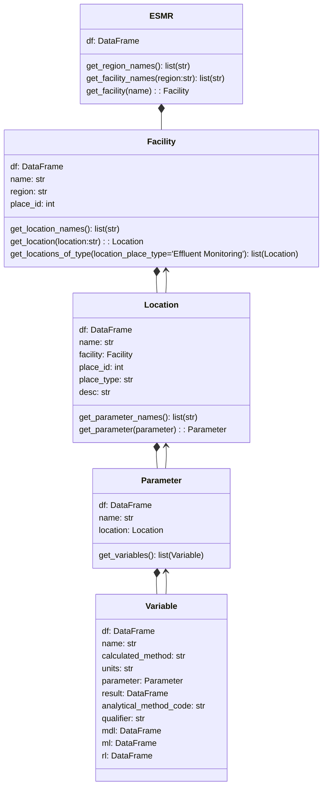

# Electronic Self Monitoring Data (ESMR)

California Integrated Water Quality System Project (CIWQS) collects the data for National Pollutant Discharge Elimination System (NPDES). Electronic Self Monitoring Data is available via the webpage https://ciwqs.waterboards.ca.gov/ciwqs/readOnly/CiwqsReportServlet?inCommand=reset&reportName=esmrAnalytical

This data is also available from California's Open Data website: https://data.ca.gov/dataset/water-quality-effluent-electronic-self-monitoring-report-esmr-data. This project parses the data from the .csv file (large > 8GB+) and uses the descriptions as defined in the data dictionary available that site to define classes that can make sense of the data

## Conceptual model

The main class is ESMR which takes a dataframe of the entire .csv file in its construction. This class can return a list of Facility names and also a Facility given a specific name.

The key concept is that of a Facility (usually a Waster Water Treament Plant (WWTP)). A Facility has a name and id and can have many Location(s).

Each Location has a name, e.g. EFF-001, of type such as 'Effluent Montioring' in this example. In addition it has also has the concept of a geo referenced latitude and longitude (this may be empty in many cases)

Each Location can measure various Parameter(s). Each Parameter has a name and is represented by one or more Variable(s).

A Variable has a name (same as Parameter), units, calculated method (such as daily mean, daily max, weekly mean, etc.). The result pandas DataFrame attached to the Variable contains the time series of values for that variable

Each of the concepts above has an attached pandas DataFrame, df, that is a subset corresponding that to that concept. E.g. the Facility has a df attribute that has a dataframe for just that Facility.

